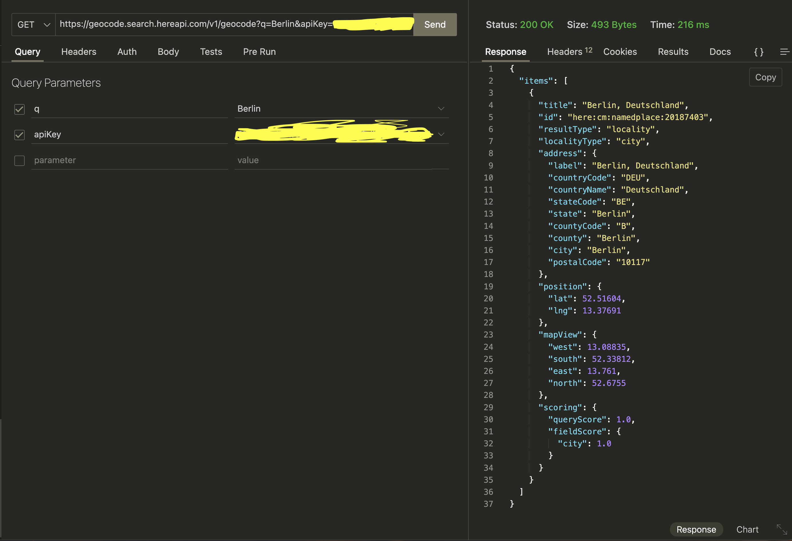
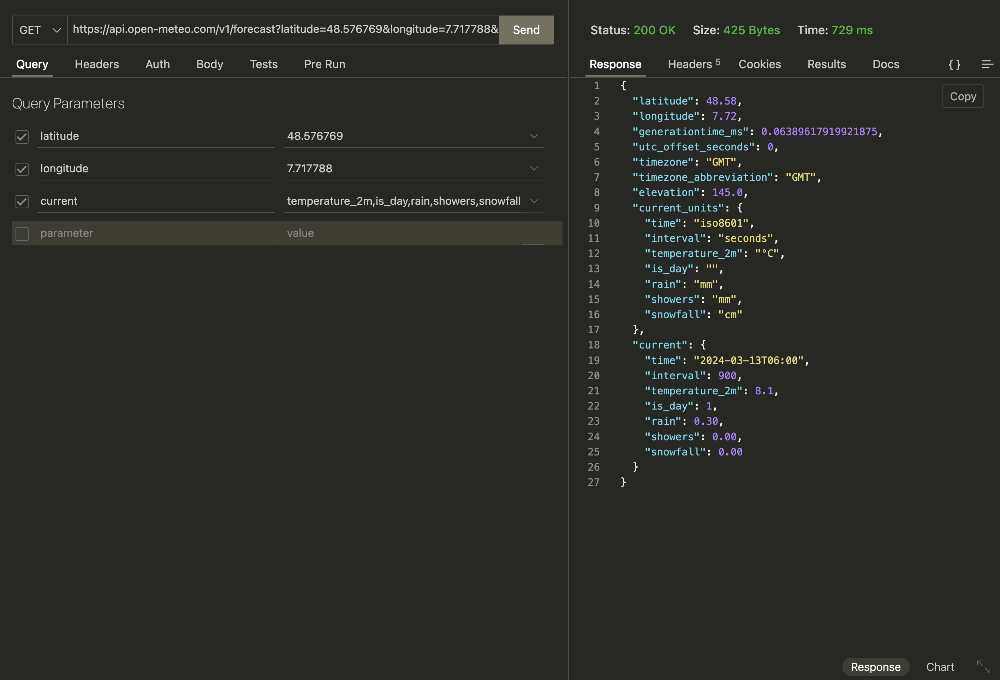
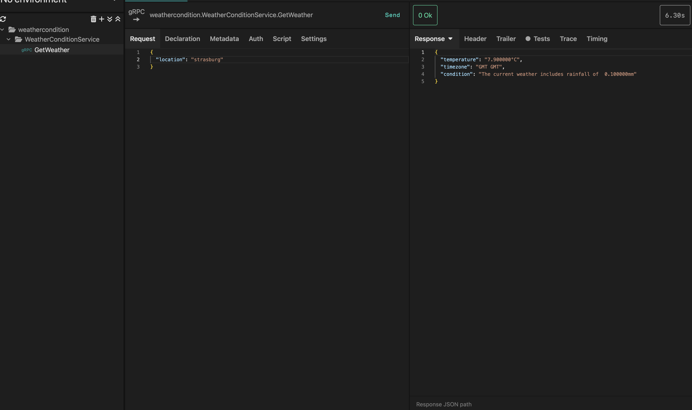

# Introduction
This microservice calls weather api and gives the weather conditions of a particular place.
It is built with Golang-gRPC and Protobuf. Its providers are requested using REST-Json.
(Exploring proto-buffers with simple microservice)

# Tech
* goversion : 1.22.0
* OS - macOs
* provider : weather api
* IDE : IntelliJ IDEA
* Kreya : 1.31.1

# Highlights
1. Protobuf - libprotoc 25.3
2. Here Maps
3. Open mateo

# FAQ
1. Install Go - brew install golang
2. Protobuf compiler Installation - brew install protobuf
    * protoc --version
3. Install Protocol Buffers(Protobuf compiler plugin for go) -  go install google.golang.org/protobuf/cmd/protoc-gen-go@v1.28
4. Install grpc (Protobuf compiler plugin for gRPC-go) : go install google.golang.org/grpc/cmd/protoc-gen-go-grpc@v1.2
5. Setup protoc in PATH :  export PATH="$PATH:$(go env GOPATH)/bin"
6. Refer : https://grpc.io/docs/languages/go/quickstart/
7. How to generate proto files? in weather-conditions repo, run "protoc --go_out=. --go-grpc_out=. proto/weather-condition-protobuf.proto"
8. How to test in Kreya? 
      * Open a new project and create .kproj file
      * Import proto files from your service in kreya.
      * Form the request and hit send.
9. How to create Here Maps API Key : https://www.here.com/docs/bundle/geocoding-and-search-api-developer-guide/page/topics/quick-start.html#send-a-request

# Images
1. Here maps REST request

2. Open-Mateo REST request

3. weather-conditiones gRPC Kreya request
